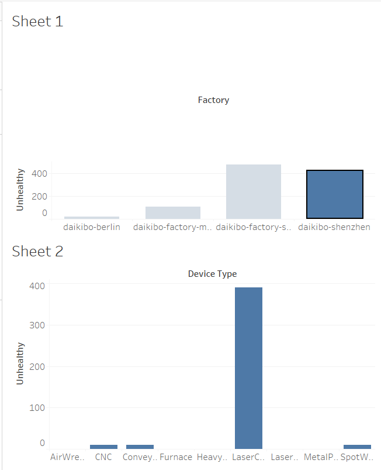
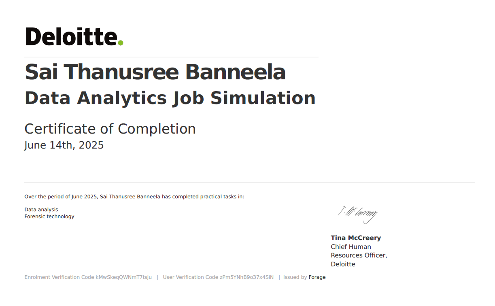

# Deloitte Data Analytics Virtual Experience Program

This repository contains the completed tasks for the **Deloitte Data Analytics Virtual Internship**, hosted on **Forage**.

## 📌 Overview

This project simulates the work of a data analyst at Deloitte. It includes data cleaning, visualization, and the development of a proposal for improving data visibility within the company.

## ✅ Tasks Completed

- Explored and cleaned raw client and sales data
- Performed basic data analysis using Excel
- Built a dashboard for clear data visualization
- Prepared a final proposal report with actionable insights

## 📊 Dashboard Preview

## 🛠️ Tools & Technologies

- Microsoft Excel
- Data Visualization
- PowerPoint (for the final proposal)
- Communication & Reporting Skills

## 🏆 Certificate

**Deloitte Australia – Technology Job Simulation**  
Completed through Forage

This project was completed as part of a self-paced virtual experience through [Forage](https://www.theforage.com/).

